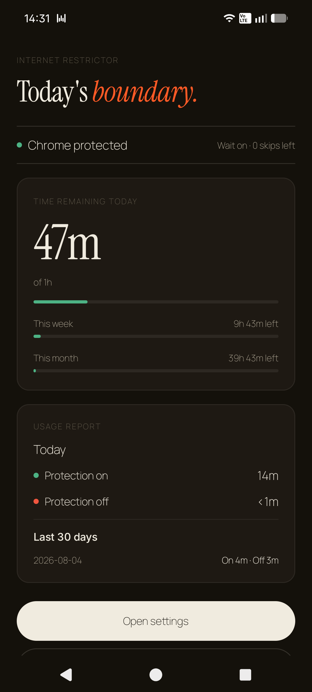
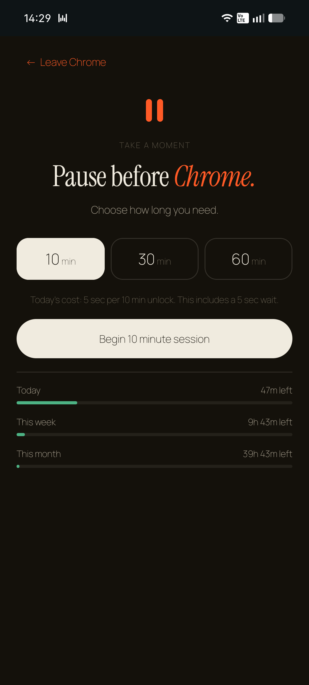
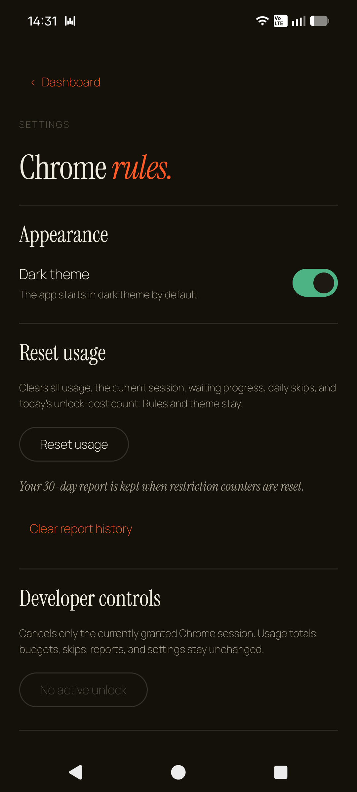

<h1 align="center">Internet Restrictor Retro</h1>

<em>A small pause between impulse and browsing.</em>

  An Android app that adds a little friction before browsing and keeps your
  shared browser time inside daily, weekly, and monthly limits.

  
  
  

## What it does

When you open Chrome, Firefox, Edge, or Opera, you choose a 10, 30, or 60 minute
session and wait a few seconds before it begins. The app tracks active use across
all four browsers in one shared budget and shows how much time remains in your
daily, weekly, and monthly budgets.

It is a personal speed bump, not an unbreakable blocker. You remain in control
and can turn it off whenever you choose.

No account. No ads. No analytics. No internet permission. Everything stays on
your phone.

## Put it on your Android phone

Retro is distributed as a manually installed APK. It requires Android 10 or
newer.

1. Download the newest `.apk` from the repository's
   [Releases](https://github.com/bald-ai/internet-restrictor-retro/releases)
   page.
2. Open the downloaded file on your phone and allow installation from that
   source if Android asks.
3. Open Retro and follow its four setup screens.
4. Enable Retro's Accessibility service when prompted. On some sideloaded
   Android 13+ devices, App info may first require **Allow restricted settings**.

Android requires you to enable the service yourself. A computer, ADB, root, VPN,
account, or Usage Access permission is not required.

### Supported browsers

Retro supports these stable Android apps:

- Google Chrome (`com.android.chrome`)
- Mozilla Firefox (`org.mozilla.firefox`)
- Microsoft Edge (`com.microsoft.emmx`)
- Opera (`com.opera.browser`)

They use one shared budget. Other browsers—including Brave, Samsung Internet,
Vivaldi, DuckDuckGo, Firefox Focus/Beta, Chrome Beta/Canary, Edge Beta, and Opera
Mini—are not currently restricted.

### Installing an update

Download the newer APK and open it. Android should offer **Update**. Do not
uninstall the existing app first: an in-place update keeps your Retro settings,
usage, and report history.

This is beta software. Android manufacturers can differ in their Accessibility
and background-service behavior.

## Building from source

Developers can clone the repository and run `./gradlew assembleDebug`. Locally
built APKs use the builder's own signing identity, so they are not guaranteed to
update an APK downloaded from this repository's Releases page.

## Free to use

Use it, change it, and share it under the [0BSD license](LICENSE). The bundled
fonts remain under their own free and open license described in
[THIRD_PARTY_NOTICES.md](THIRD_PARTY_NOTICES.md).
